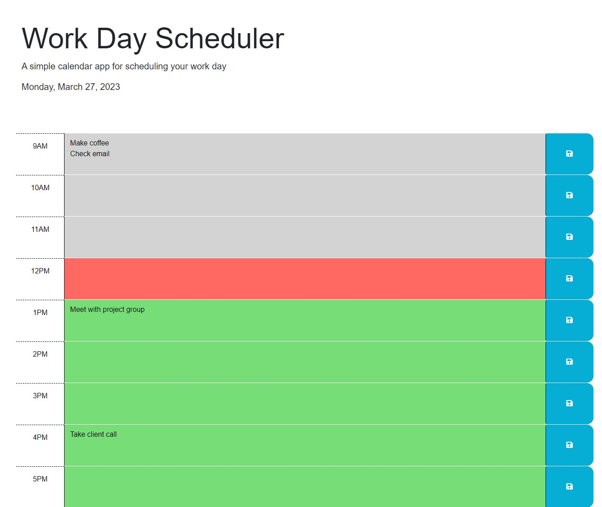

# Work Day Scheduler

## Description

This is a webpage refactored as a work day scheduler. A user can enter what they want to do in a textarea of the corresponding hour. They can then press save and have that text saved.

The main componenets to this webpage are:
- object modification
- local storage
- event listeners
- this
- add class via JS
- jQuery
- Bootstrap
- day.js

In the future, a few features will be added:
- keyup event listener on enter key for start button
- keyup event listener on enter key for save score button
- keyup event listener on enter key for "Play Again" button
- keyup event listeners on 1, 2, 3, and 4, keys for selecting answer choices
- display if previous questions was right or wrong to user

## Installation

N/A

## Usage

Webpage: https://ctalv.github.io/work_day_scheduler/

## Credits

Starter Code: https://github.com/coding-boot-camp/crispy-octo-meme

## License

MIT License

# Module_5_Challenge

